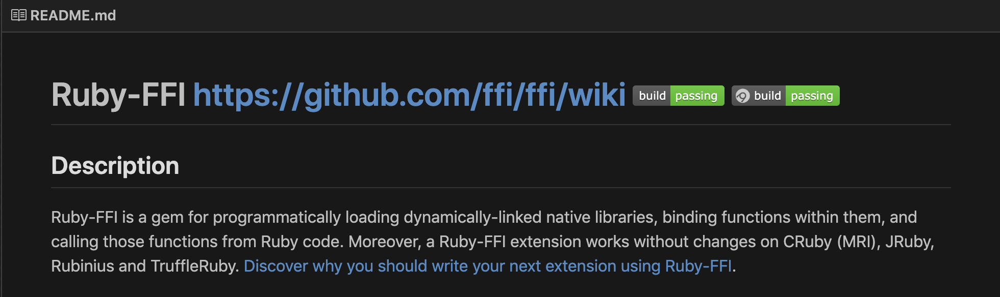

## FFI & Native Extension

---

# github.com/atomiyama/heiseirb9

---

# whoami
Akifumi Tomiyama
Studyplus Inc,
server-side enginner

- github: @atomiyama
- Twitter: @atomiyama1216

---

# 好きな言語はなんですか?

---

# Rust & Ruby

---

## RubyからRustを呼んでみたい

---

## why
- 早いらしい
- 低レイヤの言語書いてみたかった
=> それを好きなRubyから呼べたら楽しそう

---

## Rubyから他の言語を呼び出す方法
- FFI (Foreign Function Interface)
- Native Extension

---

## FFI (foreign function interface)


色々な言語で定義された関数とかをRubyから簡単に呼べるようにしてくれる．
=> Rustで書いた関数シグネチャーをRubyのスクリプトから渡して上げることでRubyからRustの関数を呼び出せるようになる

--- 

## Native Extension (拡張ライブラリ)

Rubyからは普通のライブラリと同じようにrequireして上げるだけで呼び出せる．
その代償として型情報とか，言語間の仕様の差異を埋める作業を書いてあげる必要がある．
=> ffiはこれをいい感じにやってくれてる

---

# こんにちは世界!
拡張は割愛
### Rustで適当に関数を定義
```rust
// hello_world.rs
#[no_mangle]
pub extern fn hello_world() {
    println!("Hello World, I am Rust!");
}
```

### コンパイルしてdylibファイル生成
```sh
$ rustc --crate-type="dylib" hello_world.rs
$ nm libhello_world.dylib | grep hello_world
0000000000000f10 T _hello_world
0000000000090b60 S _rust_metadata_hello_world_8787f43e282added376259c1adb08b80
```

---

## ffiでrubyから関数を呼び出す

```ruby
require 'ffi'

module RustEx
  extend FFI::Library
  ffi_lib "libhello_world.dylib"

  attach_function :hello_world, [], :void
end

pp RustEx::hello_world #=> "Hello World, I am Rust!"
```

---

# ほんとに早くなってるのか

---

# Rust Tutorialにあるやつ


---

## 10個のスレッドで500万までカウントするコード
```ruby
threads = []

10.times do
  threads << Thread.new do
    count = 0

    5_000_000.times do
      count += 1
    end

    count
  end
end

threads.each do |t|
  puts "Thread finished with count=#{t.value}"
end
puts "done!"
```

---

## Rustで書く(ffi)

```rust
#![crate_type="dylib"]
use std::thread;

#[no_mangle]
pub extern fn process() {
    let handles: Vec<_> = (0..10).map(|_| {
        thread::spawn(|| {
            let mut x = 0;
            for _ in 0..5_000_000 {
                x += 1
            }
            x
        })
    }).collect();

    for h in handles {
        h.join().unwrap();
    };
}
```

---

### Rubyから呼ぶ

```ruby
require 'ffi'

module FFIEx
  extend FFI::Library
  ffi_lib './liblib.dylib'

  attach_function :process, [], :void
end

pp FFIEx.process
```

---

# 計測してみる

```ruby
require "./ffi/main"
require "./purerb/main"
require "benchmark/ips"

Benchmark.ips do |x|
  x.report "Ruby Func" do
    PureRuby.process
  end

  x.report "Rust Func" do
    FFIEx.process
  end

  x.compare!
end

```

---

# 早い!!!
```
$ ruby benchmark.rb
Warming up --------------------------------------
           Ruby Func     1.000  i/100ms
           Rust Func     1.000  i/100ms
Calculating -------------------------------------
           Ruby Func      0.526  (± 0.0%) i/s -      3.000  in   5.709806s
           Rust Func      1.232  (± 0.0%) i/s -      7.000  in   5.684935s

Comparison:
           Rust Func:        1.2 i/s
           Ruby Func:        0.5 i/s - 2.34x  slower

```

---

時間あるかな

---
### Native Extension

```rust
#![allow(non_snake_case)]
extern crate libc;
use std::ffi::CString;
use std::thread;

type VALUE = libc::c_ulong;

extern {
    fn rb_define_module(name: *const libc::c_char) -> VALUE;
    fn rb_define_module_function(module: VALUE,
                                 name: *const libc::c_char,
                                 value: extern fn(),
                                 argc: libc::c_int) -> libc::c_void;
}

extern fn rb_process() {
    let handles: Vec<_> = (0..10).map(|_| {
        thread::spawn(move || {
            let mut x = 0;
            for _ in 0..5_000_000 {
                x += 1
            }
            x
        })
    }).collect();

    for h in handles {
        h.join().unwrap();
    };
}

#[no_mangle]
pub extern fn Init_rustex() {
    let module_name = CString::new("RustEx").unwrap();
    let process = CString::new("process").unwrap();

    unsafe {
        let rb_cRustEx = rb_define_module(module_name.as_ptr());
        rb_define_module_function(rb_cRustEx, process.as_ptr(), rb_process, 0);
    }
}
```

---

# 流れ
1. 上のコンパイル結果が`rustex.bundle`

### 呼ぶ
```ruby
require "./rustex.bundle"

RustEx.process
```

---

# 終わり
